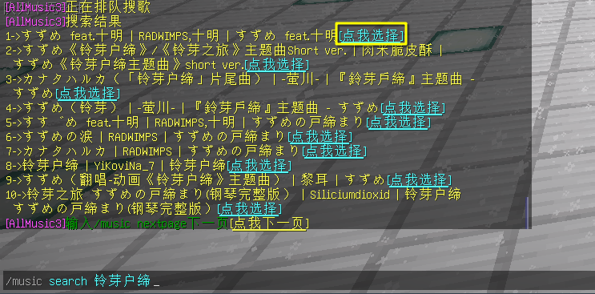
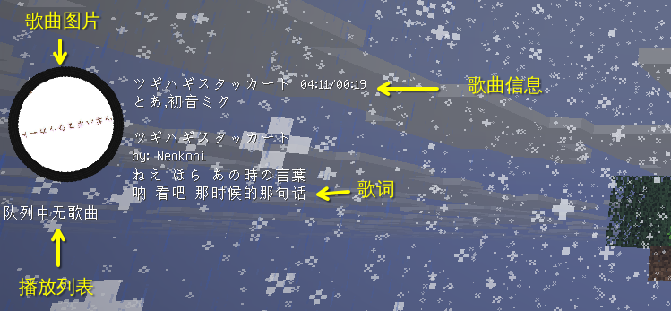

# AllMusic全局点歌
一个全局点歌插件，让同一个服务器中所有已安装客户端mod的玩家一起听歌

开源地址: [AllMusic_Server](https://github.com/Coloryr/AllMusic_Server)

在Craft233上使用此功能可以播放VIP歌曲

适用子服务器: `Terra`, `ABlock`
:::info
此插件仅支持Java版，基岩版无法听到音乐

插件不是装在代理端Velocity上的，因此不同子服务器之间的音乐不会同步
:::

## 下载客户端Mod
Craft233对1.20及以上版本的`Fabric`和`NeoForge`版本已保存在群文件

如果想自己下载请在登陆`GitHub`账号后前往[All_Music构建](https://github.com/Coloryr/AllMusic_Client/actions/)

找到最新构建，在`Artifacts`部分按照客户端版本及mod加载器选择对应版本下载

然后将解压后的mod本体放入客户端的`mods`文件夹中

## 播放歌曲
分为使用`歌曲ID`和搜索播放

### 使用搜索播放
使用搜索播放是最简单的方法

只需要`/music search <歌曲名>`即可搜索并播放歌曲

如下图所示，搜索完成后点击`点我选择`即可添加到播放列表

### 使用歌曲ID
首先了解一下什么是`歌曲ID`

歌曲ID是网易云音乐中每首歌独一无二的标签，凭此可以确定具体的一首歌

歌曲ID一般通过网易云音乐分享链接中获取

以下是网易云音乐中一首歌的分享连接

`https://music.163.com/#/song?id=1879098277`

其中`song?id=`后面的`1879098277`就是歌曲ID

在服务器中使用如下指令即可通过歌曲ID播放歌曲

`/music 1879098277`

## 设置HUD
默认情况下HUD显示在游戏内左上角，可以通过以下指令设置HUD的位置或者关闭HUD

### 开启或关闭HUD
如下指令用于切换

`/music hud enable`

其余每个小部分也可单独用于设置开关

每个小部分分为`info`， `list`，`lyric`，`pic`

分别对应`歌曲信息`，`播放别表`，`歌词`，`歌曲图片`

通过`/music hud 小部分 enable`切换小部分内容的显示状态

比如`/music hud pic enable`用于切换歌曲图片的显示状态

### 设置HUD位置
可用的位置有`BOTTOM_CENTER`, `BOTTOM_LEFT`, `BOTTOM_RIGHT`, `CENTER`，`LEFT`，`RIGHT`，`TOP_CENTER`，`TOP_LEFT`，`TOP_RIGHT`

每个小部分分为`info`， `list`，`lyric`，`pic`

这里不对位置意思做介绍，不懂请使用翻译软件翻译

用法: `/music hud 小部分 dir 位置`

例如将图片显示在屏幕左侧则为

`/music hud pic dir LEFT`

如果需要微调，则使用`x`和`y`参数

比如将图片显示在屏幕左侧，并且x轴偏移5个像素，y轴偏移10个像素则为

`/music hud pic pos x y`

如果需要恢复默认，则可以使用

`/music hud reset`全部重置

## 控制音乐播放
为自己取消当前歌曲播放`/music stop`

取消自己已添加到播放列表但是还未播放的歌曲`/music cancel`

不要听到别人的音乐`/music mute`

...

## 所有指令说明
:::info
转载于[AllMusic_Server](https://github.com/Coloryr/AllMusic_Server?tab=readme-ov-file#%E6%8C%87%E4%BB%A4%E8%AF%B4%E6%98%8E)
:::

- /music [音乐ID/网易云分享链接] 点歌

- /music stop 停止播放歌曲

- /music list 查看歌曲队列

- /music cancel [序号] 取消你的点歌

- /music vote 投票切歌

- /music vote cancel 取消发起的切歌

- /music push [序号] 投票将歌曲插入到队列头

- /music push cancel 取消发起的插歌

- /music mute 不再参与点歌，再输入一次恢复

- /music mute list 不接收空闲列表点歌，再输入一次恢复

- /music search [歌名] 搜索歌曲

- /music select [序列] 选择歌曲

- /music nextpage 切换下一页歌曲搜索结果

- /music lastpage 切换上一页歌曲搜索结果

- /music hud enable 启用/关闭全部界面

- /music hud reset 重置全部界面

- /music hud [位置] enable 启用关闭单一界面

- /music hud [位置] pos [x] [y] 设置某个界面的位置

- /music hud [位置] dir [对齐方式] 设置某个界面的对齐方式

- /music hud [位置] color [颜色HEX] 设置某个界面的颜色

- /music hud [位置] reset 重置单一界面

- /music hud pic size [尺寸] 设置图片尺寸

- /music hud pic rotate [开关] 设置图片旋转模式

- /music hud pic speed [数值] 设置图片旋转速度