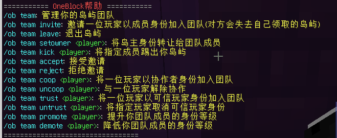

# AOneBlock单方块生存
介绍单方块生生存服务器的主要命令`ob`

适用子服务器: `ABlock`

## 帮助
显示单方块生存的帮助信息

用法: `/ob help`

## 创建空岛或返回空岛
执行后如果玩家没有空岛则会立即为玩家创建空岛，然后将玩家传送到空岛

若玩家有空岛则会直接将玩家传送到空岛

用法: 
- `/ob`  创建空岛或返回空岛

- `/ob go <岛屿名>` 传送到自己的岛屿

## 返回服务器出生点
执行后回到单方块生存的出生点

用法: `/ob spawn`, `/spawn`

## 创建空岛
使用指令创建一个空岛

用法: `/ob create`

## 设置岛屿
### 综合管理
打开设置岛屿的箱子菜单

用法: `/ob settings`

### 岛屿名称
设置岛屿名称

用法: `/ob setname <岛屿名>`

重置岛屿名称到默认

用法: `/ob resetname``

### 修复方块消失
在单方块生存中生成方块消失的情况下修复此问题

用法: `/ob respawnBlock`

## 设置生物群系
在单方块生存中设置单个岛屿的生物群系

用法: `/ob biomes`

:::info
如果你无法打开GUI或显示有问题，可以使用以下格式使用命令设置

`/ob biomes set <生物群系>`

<生物群系>可以通过查询wiki获取或者使用`TAB键`进行补齐
:::

## 设置方块阶段
手动设置数量以提前进入或回退方块等级，用于刷新不同等级的方块

用法: `/ob setCount <数字>`

## 设置语言
设置单方块生存插件提示的语言

用法: `/ob language`

## 岛屿传送设置
:::info
此命令是单方块生存自带的功能，独立于HuskHomes插件提供的家功能
:::
### 新加传送点
为自己岛屿新增一个传送点

用法: `/ob sethome <传送点名称>`

### 显示传送点
显示自己的岛屿所有的传送点

用法: `/ob homes`

### 设置传送点
重命名传送点

用法: `/ob renamehome <旧传送点名称>`

删除传送点

用法: `/ob deletehome <传送点名称>`

## 成员设置
### 管理岛屿黑名单
将一位玩家添加到当前岛屿的黑名单

用法: `/ob ban <玩家名称>`

将一位玩家从当前岛屿的黑名单中移除

用法: `/ob unban <玩家名称>`

### 驱逐玩家
将玩家从当前岛屿中驱逐

用法: `/ob expel <玩家名称>`

### 岛屿团队设置
:::info
不想写了，自己看图吧
:::
