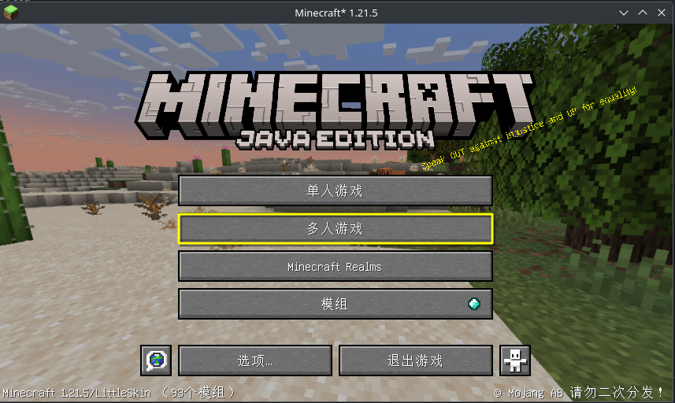
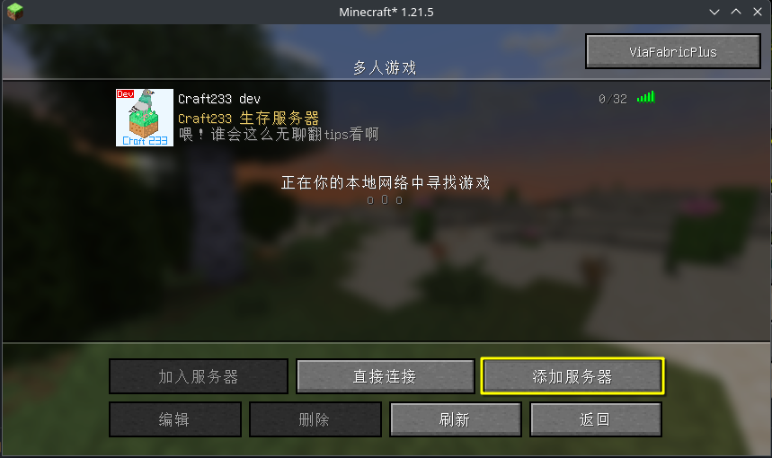
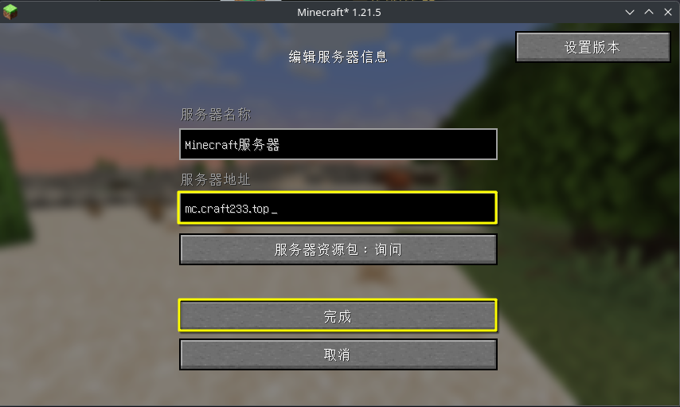
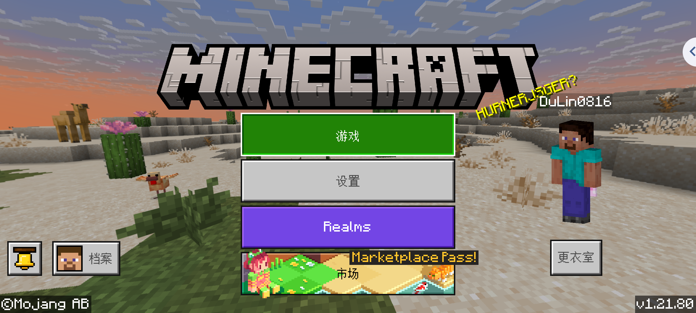
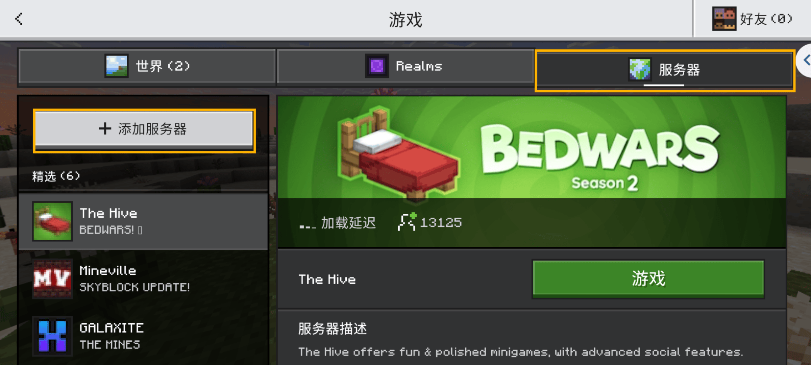
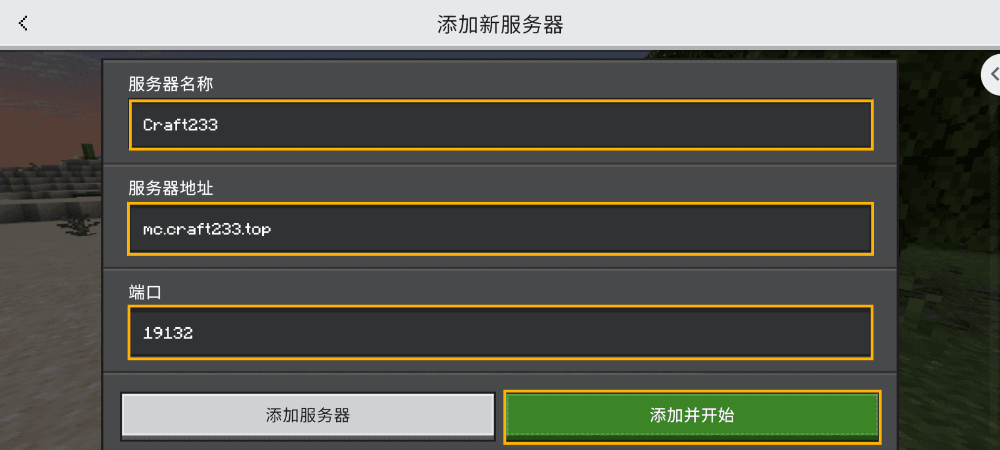

# 正式进入🧭
从此刻正式添加Craft233服务器并加入

## 服务器地址说明
目前Craft233一共有两个连接地址，分别如下:

- `mc.craft233.top`

- `mc2.craft233.top`

正常使用`mc.craft233.top`即可，端口信息无需额外修改

如果网络波动严重，Craft233也有两个备用地址，选择其一使用即可

- `mc1.craft233.top`    深圳节点

- `mc2.craft233.top`    枣庄节点

端口信息为Java版: `45565`，基岩版: `41932`

## 截图参照
### Java版

### 基岩版

