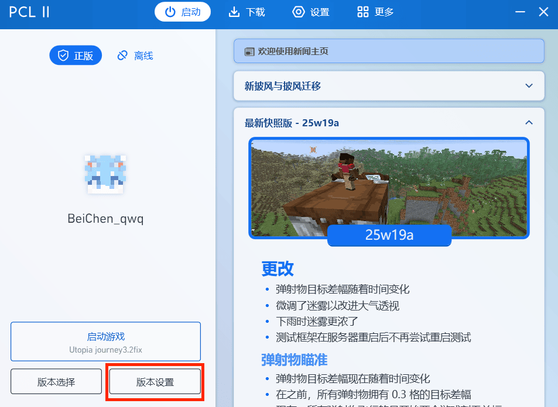
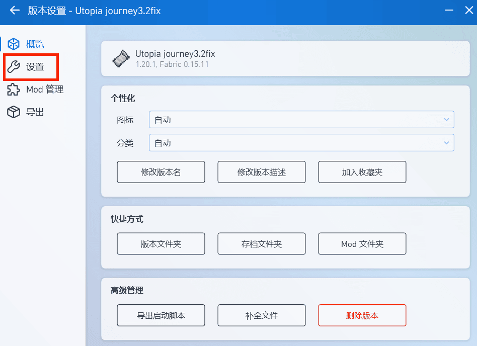
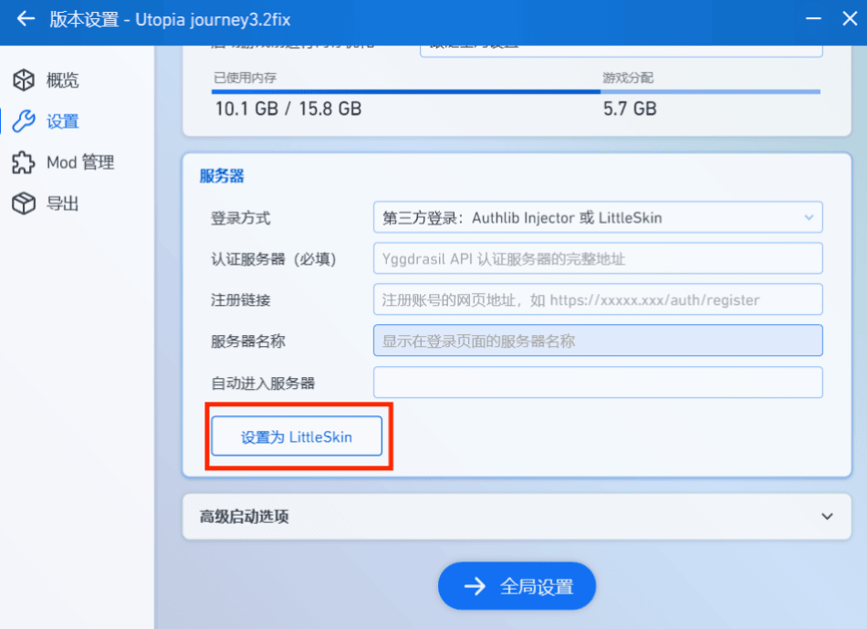

# 准备账号🌏
从第三周目开始，Craft233开始使用外部验证的登录方式，废弃原有的`authme`使用密码的登录方式

我们使用`MultiLogin`接入了三种登录方式

- 微软正版验证

- LittleSkin外置登录
 
- 基岩版Xbox登录

## 微软正版和基岩版Xbox登录
已购买Minecraft微软账号在启动器登录，直接启动游戏即可

基岩版登陆Xbox账户即可，如没有Xbox账户，请先创建一个Xbox账户，然后使用Xbox账户登录即可

相关链接: [Xbox账户](https://www.xbox.com/zh-CN/live/)

::: info
- 如果出现验证码无法加载，请使用游戏加速器加速微软相关游戏或使用科学上网

- 请在创建用户时尽量不要使用带空格的游戏名
:::

## LittleSkin外置登录
如果你还没有LittleSkin账号，请先去[LittleSkin](https://littleskin.cn)注册一个账号并创建角色

接着打开启动器，添加账户，选择`外置登录`或`LittleSkin`

::: info
LittleSkin Yggdrasil API: `https://littleskin.cn/api/yggdrasil`
:::

对于HMCL启动器配置，请参考[LittleSkin用户使用手册](https://manual.littlesk.in/yggdrasil/client)

对于PCL启动器配置，请参考以下截图，并在选择`设置为LittleSkin`后填入账号信息

::: info
感谢[BeiChen北尘](https://www.beichen.icu)提供的PCL截图
:::

